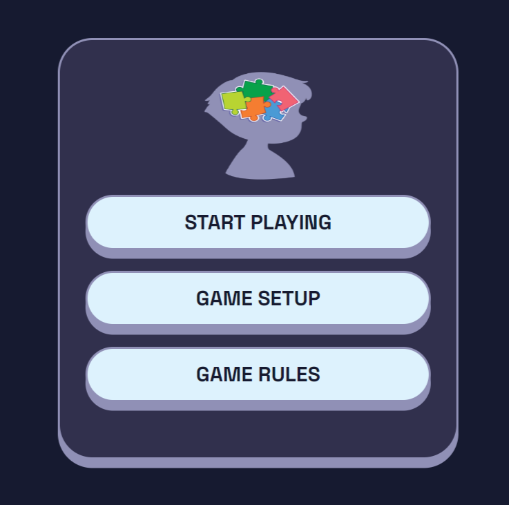

# Memory-Card-Game
This is an app for playing a memory card game with many players.
## Covered Topics
  - html5
  - Sass /css3
  - javaScript / Es6 / TypeScript
  - Dom / Bom / Json / sound / classes / interfaces
## App Functionalities
  - Before Playing you make your game setup.
  - Select your cards type (Numbers/ Icons),
  - Select players count (1/ 2/ 3/ 4) player,
  - Select cards grid (4*4/ 6*6 /8*8),
  - Play sounds or not.
  - You can show game rulers before playing
  - If only one player play, he fliped all the card with free time play.
  - In turn, each player has 15 seconds only to match many cards as he can.
  - If he matches two cards correct, the cards will color like his color.
  - If he matches two cards wrong, he wait until next turn to able to play again.
  - During playing, you see the results of correct/ wrong matched.
  - The game ends when all cards all flipped.
# Site ScreenShot

